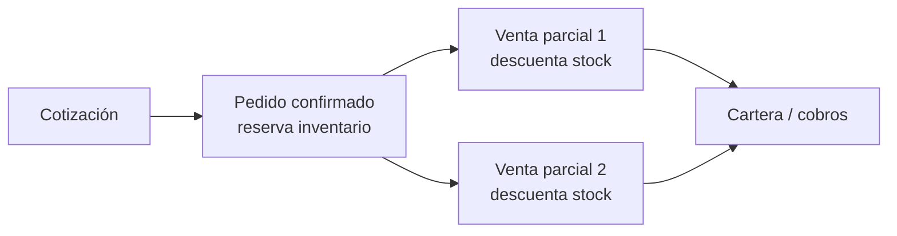
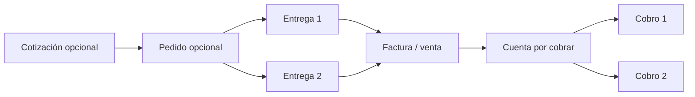

# Decisión de producto: pedidos, entregas, facturación y cartera

Fecha: 2026-09-23  
Alcance: modelo comercial transversal de Auna ERP. Este documento no cambia todavía tablas, rutas ni documentos fiscales.

## Conclusión ejecutiva

Tu intuición es correcta: el flujo actual de **Pedido → una o varias ventas** mezcla dos hechos distintos:

1. **Entregar** productos: operación logística e inventario.
2. **Facturar o registrar una venta**: operación comercial, fiscal y de cartera.

Un pedido no debe obligar a crear varias ventas solo porque se entrega por partes. Las **entregas parciales** son las que pueden ser múltiples. La venta o factura puede ser una o varias únicamente cuando la política comercial y fiscal de la empresa lo necesita. Los pagos deben vivir en **Cartera / Cuentas por cobrar**, aplicados contra ventas o facturas emitidas, y nunca definir si un pedido fue entregado.

No se recomienda eliminar Pedidos. Se recomienda redefinirlos: son un compromiso comercial y, si se configura así, una reserva de inventario. No son una factura, un cobro ni una entrega.

## Qué ocurre hoy en Auna

El comportamiento existente es coherente para un caso específico de despacho inmediato, pero es ambiguo como modelo general:

- Al confirmar el pedido se reserva inventario.
- Al convertirlo a venta se eligen líneas o cantidades pendientes, se descuenta stock y se incrementa la cantidad cumplida del pedido.
- Esa operación puede repetirse y termina el pedido como parcial o completado.
- Cartera ya aplica cobros a las ventas a crédito mediante recibos y abonos.

El problema no es soportar cantidades parciales. El problema es que la operación llamada "venta" también hace de **entrega**. En muchos negocios, emitir dos ventas o facturas para dos despachos puede ser correcto; en otros no, y puede tener implicaciones tributarias, de crédito y de atención al cliente.

## Las cuatro cosas que deben separarse

| Concepto | Pregunta que responde | Efecto principal | No debe decidir |
|---|---|---|---|
| Cotización | ¿Qué se ofreció al cliente? | Propuesta y precio | Stock, deuda o factura |
| Pedido | ¿Qué se comprometió el cliente a comprar? | Demanda, condiciones y posible reserva | Entrega, cobro o ingreso contable |
| Entrega / despacho | ¿Qué salió físicamente y cuándo? | Movimiento de inventario y trazabilidad | Deuda del cliente |
| Venta / factura | ¿Qué se cobró o se debe cobrar? | Documento fiscal/comercial y cuenta por cobrar | Si toda la mercadería ya se entregó |
| Cobro | ¿Qué dinero recibió la empresa? | Baja de la deuda en Cartera | Estado de preparación o entrega |

La relación correcta no siempre es uno a uno:

Un pedido puede no tener cotización. Un pedido puede tener varias entregas. Una factura puede cubrir una entrega, varias entregas o, según la regla del negocio, emitirse antes de la entrega. Una factura puede tener varios abonos.

## Respuestas directas a tus dudas

### ¿Un pedido debe convertirse en una o varias ventas?

No como regla universal. Solo debe generar varias facturas o ventas cuando la empresa decide facturar por despacho, por avance, por periodo o por cada entrega. Si el cliente compra 100 unidades y recibe 40 hoy y 60 mañana, la opción natural para la mayoría de escenarios es tener **dos entregas** y una factura según la política elegida; no crear automáticamente dos ventas.

### ¿Los pagos deberían estar en Cartera?

Sí. Una venta al crédito crea una deuda; Cartera registra recibos, anticipos, abonos, vencimientos y ajustes contra esa deuda. El pago cambia el saldo y el estado de cobro (`pendiente`, `parcial`, `pagado`), pero no debe cambiar por sí mismo el estado de despacho del pedido.

### ¿Cotización → pedido → venta es un mal flujo?

No; es un flujo B2B válido, sobre todo para mayoristas, distribución, fabricación bajo pedido y servicios. Lo incorrecto sería hacerlo obligatorio para una tienda, restaurante, POS, negocio de servicios o empresa que factura directamente. La cadena debe ser **opcional por perfil operativo**.

### ¿Cada negocio necesita un flujo distinto?

Necesita reglas distintas, no un sistema distinto ni un motor de workflows genérico. Auna debe ofrecer unos pocos perfiles claros, configurables por empresa, y mantener el mismo modelo de documentos por debajo.

## Perfiles operativos propuestos

| Perfil | Flujo visible | Cuándo usarlo |
|---|---|---|
| Venta directa / POS | Venta o factura → cobro de contado o Cartera | Tienda, mostrador, restaurante, venta rápida |
| B2B simple | Cotización opcional → factura/venta → entrega opcional → Cartera | Venta profesional sin reserva ni despachos complejos |
| Pedido y despacho | Cotización opcional → pedido → entrega(s) → factura(s) → Cartera | Distribución, mayoreo, almacenes, venta bajo pedido |
| Servicios | Cotización opcional → orden/servicio → factura(s) → Cartera | Consultoría, mantenimiento, proyectos; no hay entrega de stock |

El perfil inicial selecciona qué pantallas y acciones se muestran. No sustituye permisos, activación comercial de módulos ni validaciones del backend.

## Alternativas consideradas

### 1. Mantener el flujo actual y solo cambiar nombres

Podríamos llamar "despacho" a la conversión parcial, pero seguiría creando una venta por cada despacho. Es el cambio más pequeño, pero conserva la mezcla de inventario, facturación y crédito. No se recomienda como base del ERP.

### 2. Quitar Pedidos y vender directamente

Simplifica el POS, pero elimina el compromiso comercial, la reserva y el control de pendientes que sí necesitan distribuidores y ventas B2B. Tampoco se recomienda: reemplaza una complejidad válida por una limitación.

### 3. Separar Pedido, Entrega, Factura y Cartera — recomendada

Pedidos conserva la intención de compra y reserva. Entregas registra qué sale del inventario. Facturas/Ventas registra lo que se cobra o queda por cobrar. Cartera administra la deuda y los pagos. Es suficientemente común para Guatemala, Centroamérica, Latinoamérica y otros mercados, sin imponer un único proceso a todos.

### 4. Crear un constructor de workflows por empresa

No hace falta ahora. Generaría combinaciones difíciles de probar, soporte y contabilidad inconsistente. Perfiles limitados y reglas explícitas cubren el caso real con mucho menos riesgo.

## Decisión recomendada

Adoptar el modelo de la alternativa 3 con estas reglas:

1. **Pedido confirmado** reserva inventario solo cuando la empresa habilita reserva; no crea ingreso ni deuda.
2. **Entrega** es el único documento que descuenta stock por cumplimiento del pedido. Un pedido puede tener cero, una o muchas entregas.
3. **Factura/Venta** crea ingreso y, cuando corresponde, una cuenta por cobrar. Puede emitirse al confirmar el pedido, al entregar o al cerrar todas las entregas, según una política explícita.
4. **Cartera** es la única fuente de verdad para cobros, saldo, vencimiento, créditos y aplicación de pagos.
5. Los estados de pedido, entrega, factura y cobro permanecen independientes. La interfaz puede resumirlos, pero nunca colapsarlos en un único estado.

### Política de facturación

Cada empresa deberá elegir uno de estos modos, con un valor inicial definido al activar el perfil:

- **Al emitir el pedido:** útil si el compromiso ya es facturable.
- **Por cada entrega:** útil si cada despacho debe documentarse y cobrarse.
- **Al completar el pedido:** útil si se emite una factura consolidada al final.
- **Manual:** un usuario autorizado decide cuándo y qué cantidades facturar.

El modo no debe permitir facturar más cantidad que la entregada, salvo que la empresa haya elegido expresamente facturación anticipada. Las exigencias fiscales concretas, por ejemplo DTE e integraciones por país, deben validarse con el proveedor fiscal y asesoría local antes de fijar un modo predeterminado por jurisdicción.

## Estados recomendados y su responsabilidad

| Documento | Estados mínimos | Quién los cambia | Qué significa |
|---|---|---|---|
| Cotización | borrador, enviada, aceptada, vencida, cancelada | Comercial | Oferta, no obligación ni deuda |
| Pedido | borrador, confirmado, cerrado, cancelado | Comercial / operaciones | Compromiso y pendientes; `cerrado` no significa pagado |
| Entrega | borrador, preparada, en tránsito, entregada, cancelada | Bodega / logística | Movimiento físico de mercancía |
| Factura/Venta | borrador, emitida, anulada, acreditada | Ventas / facturación | Evento comercial y fiscal |
| Cuenta por cobrar | pendiente, parcial, pagada, vencida | Derivado de Cartera | Saldo de documentos emitidos |

En particular, `parcialmente entregado` debe ser un resumen derivado de las entregas contra las líneas del pedido, no un sustituto de una factura parcial.

## Experiencia de usuario que evita la confusión

En un pedido administrativo, las acciones deben ser explícitas:

- **Confirmar pedido**: reserva o confirma la demanda.
- **Registrar entrega**: seleccionar cantidades que salen; no pedir método de pago.
- **Facturar**: seleccionar cantidades facturables según la política; no usarlo como botón de despacho.
- **Ver cartera**: mostrar saldo de las facturas del cliente y abrir el estado de cuenta.
- **Registrar cobro**: acción propia de Cartera, aplicable a una o varias facturas abiertas.

El detalle del pedido puede mostrar cuatro bloques independientes: resumen del pedido, entregas, facturas/ventas y cartera. Así administración ve el contexto sin confundirlo con la vista pública del cliente.

## Transición desde el comportamiento actual

No debe hacerse una reescritura ni borrar datos históricos.

1. Mantener rutas y enlaces actuales para pedidos ya creados.
2. Presentar las ventas históricas vinculadas al pedido como "ventas/facturas generadas"; conservar sus cantidades cumplidas y movimientos existentes.
3. Introducir el concepto de entrega solo para pedidos nuevos o empresas que activen el perfil de pedido y despacho.
4. Migrar gradualmente el botón actual `convert-to-sale`: primero separar interfaz y caso de uso; después dejarlo como compatibilidad para el modo heredado hasta que los clientes relevantes migren.
5. No cambiar contratos HTTP ni datos contables existentes sin migración, pruebas de equivalencia y validación fiscal.

## Hoja de ruta mínima y segura

### Fase 0 — Decisión de negocio

Definir perfiles iniciales y política de facturación por defecto. No construir un editor libre de workflows.

### Fase 1 — Claridad sin romper nada

Separar etiquetas y resúmenes de "pedido", "entrega", "factura" y "cobro" en las vistas. Evitar seguir llamando "registrar venta" a una entrega parcial.

### Fase 2 — Entregas como piloto

Crear un documento de entrega con líneas, origen, destino, responsable, fecha, estado y relación al pedido. El descuento de inventario pasa a ese caso de uso.

### Fase 3 — Facturación y Cartera desacopladas

Permitir facturar según la política elegida y relacionar factura con pedido y/o entregas. Cartera continúa aplicando pagos a ventas/facturas emitidas, no a pedidos.

### Fase 4 — Migración controlada

Convertir el flujo heredado solo donde la equivalencia esté probada. Mantener compatibilidad y auditoría de cantidades hasta que no haya pedidos pendientes en el modo anterior.

## Decisiones que faltan antes de implementar

1. ¿Qué perfil será el valor predeterminado para una empresa nueva: venta directa/POS o B2B simple?
2. ¿Qué empresas iniciales necesitan reserva de inventario al confirmar un pedido?
3. Para pedido y despacho, ¿la factura se emite por entrega, al final o bajo decisión manual?
4. ¿Se permitirá facturación anticipada y en qué países o integraciones fiscales?
5. ¿Las entregas requieren guía, transportista, firma/confirmación del cliente o solamente salida de bodega en la primera versión?

## Recomendación final

Para Auna como ERP generalista: **venta directa debe ser simple; cotización y pedido deben ser opcionales; las entregas parciales deben vivir en logística; y los pagos deben vivir en Cartera.** Este modelo conserva la potencia que un mayorista necesita sin obligar a una tienda o empresa de servicios a recorrer cuatro documentos para vender.
